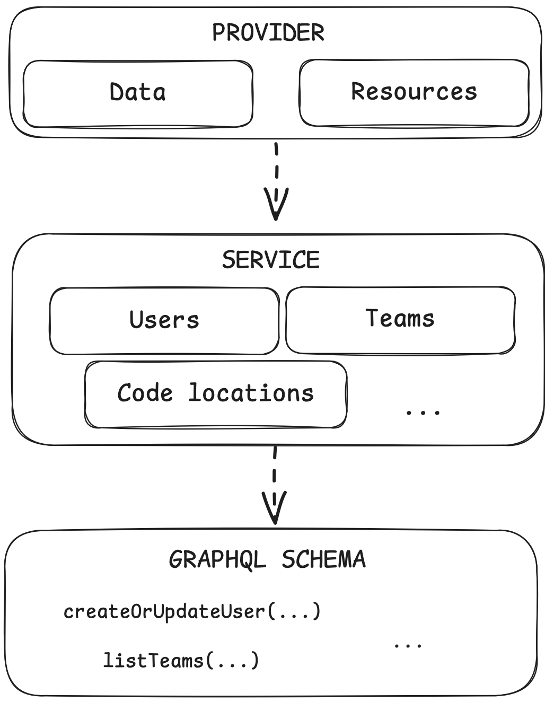

# Design

This document outlines the overall design of this project.

## Goals

- Provide a Terraform provider for interacting with Dagster Cloud

## Architecture

    

The provider allows Terraform to interact with Dagster using three layers:

- The Provider layer defines the Terraform resources and data resources. It depends on the Service Layer for all interactions with Dagster.
- The Service Layer provides high-level abstractions to modify the state of the Dagster instance
- The Schema Layer wraps individual endpoints of the Dagster GraphQL API in a type-safe way

Each layer has its own responsibility and only knows about the layer directly below it.

### Provider layer

See: [internal/provider](https://github.com/datarootsio/terraform-provider-dagster/tree/main/internal/provider)

Responsibilities:

- Define the Terraform resources and data resources
- Parse the arguments and make sure the state file is up to date
- This Layer should contain as little logic as possible related to Dagster. Ideally, it simply forwards the requests to the Service Layer.

### Service layer

See: [internal/client/service](https://github.com/datarootsio/terraform-provider-dagster/tree/main/internal/client/service)

Responsibilities:

- Provide high-level abstractions to modify a Dagster instance (e.g. assigning users to teams)

### Schema layer

See: [internal/client/schema](https://github.com/datarootsio/terraform-provider-dagster/tree/main/internal/client/schema)

The code in this layer is generated from the GraphQL schema and queries using [genqlient](https://github.com/Khan/genqlient). A makefile target is available to regenerate its code. The generated code should not be modified manually.

Responsibilities:

- Wrap individual GraphQL queries and mutations in a type-safe way
- Provide low-level abstractions to modify a Dagster instance

## Testing

- The provider layer is tested using [Terraform's provider testing framework](https://github.com/hashicorp/terraform-plugin-testing/) and runs against a Dagster Cloud instance. Each new resource or data object must have a test that uses resource in a code sample, and verify the state file and the updates in Dagster Cloud.
- The service layer is tested against a real Dagster Cloud instance. Each new function in this layer must have a test that verifies its behaviour against the test instance.
- The schema layer is not tested, since its code is 100% generated.
